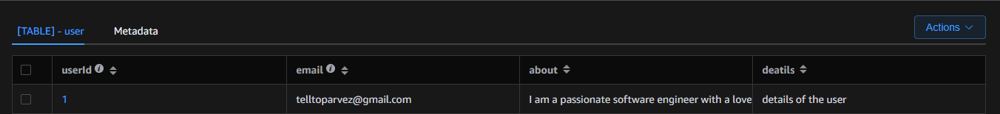

# NextJs-KoaJs-DynamoDB-Boilerplate
## Description
`NextJs-KoaJs-DynamoDB-Boilerplate` is a starter template designed to help you quickly set up a web application with Next.js, Koa.js, and DynamoDB. It integrates Chakra UI for creating responsive user interfaces.

### Key Features
- Next.js: Supports server-side rendering and static site generation.
- Koa.js: A lightweight framework for building server-side applications.
- DynamoDB: AWS's NoSQL database for performance and scalability.
- Chakra UI: A component library for building responsive React applications.


## Technologies Used
- Backend: Node.js with Koa.js
- Frontend: Next.js with Chakra UI
- Database: DynamoDB

## Features for MVP (Minimum Viable Product)
## Setup instructions for Database
Setup the dynamoDB using the steps found here.

### Sample Database Configuration
```javascript
const { DynamoDBClient } = require('@aws-sdk/client-dynamodb');

const client = new DynamoDBClient({
  region: 'us-west-2',
  endpoint: 'http://localhost:8000',
  apiVersion: '1'
});

module.exports = { client };
```
### Sample Table 


## Setup instructions for both backend and frontend

### Using Docker
```bash

git clone https://github.com/piru72/nextjs-koajs-dynamodb-boilerplate.git

cd nextjs-koajs-dynamodb-boilerplate

docker compose up -d
```
### Using npm

```bash
git clone https://github.com/piru72/nextjs-koajs-dynamodb-boilerplate.git

cd nextjs-koajs-dynamodb-boilerplate

cd backend

npm install

npm run dev

cd ..

cd frontend

npm install

npm run dev
```
