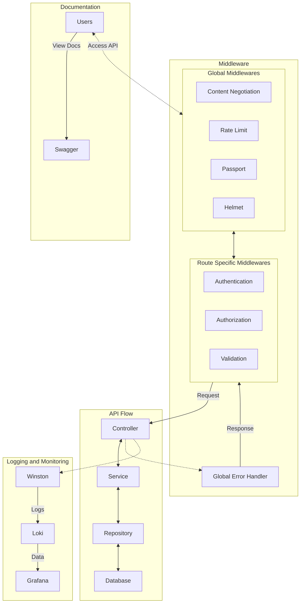

# DEV Jots Backend

## Top level Architecture



This is the structure of the project:

```bash
├── .husky
    └── pre-commit
    └── pre-push
├── src
├── .dockerignore
├── .env.example
├── .gitignore
├── .prettierignore
├── .prettierrc
├── .api-swagger.yml
├── Dockerfile
├── docker-compose.yml
├── eslint.config.js
├── knexfile.js
├── package.json
├── tsconfig.json

```

This is the structure of the project inside the `src` directory:

```bash

├───configs                 # Configuration files
├───controllers             # Request handlers
│ └───v1                    # Version 1 controllers
├───database                # Database configuration
│ └───migrations            # Knex migrations
├───dtos                    # Data transfer objects
├───helpers                 # Helper functions
├───interfaces              # Interfaces used in the application
├───middlewares             # Express middlewares
├───repositories            # Data access layer
├───routes                  # Express routes
│ └───v1                    # Version 1 routes
├───schemas                 # JSON schemas for request validation
├───services                # Business logic layer
│ ├───implementations       # Service implementations
│ └───interfaces            # Service interfaces
└───utility                 # Utility functions

```

## CRUD Endpoints

All CRUD endpoints are prefixed with `/api/v1/`. Details can be found in `http://localhost:3000/api-docs`. The following endpoints are available:

### Auth

| Endpoint      | Method | Description                   | Request Body        | Response                                                |
| ------------- | ------ | ----------------------------- | ------------------- | ------------------------------------------------------- |
| `/auth/login` | POST   | Login with email and password | `email`, `password` | `200`: `token`, `400`: `Bad request (validation error)` |

### User

| Endpoint      | Method | Description                  | Request Body                    | Response                                                      |
| ------------- | ------ | ---------------------------- | ------------------------------- | ------------------------------------------------------------- |
| `/users`      | POST   | Create a new user            | `username`, `email`, `password` | `201`: `User created successfully`, `400`: `Invalid input`    |
| `/users`      | GET    | Get all users                | None                            | `200`: List of all users                                      |
| `/users/{id}` | GET    | Get a specific user by ID    | None                            | `200`: `User retrieved successfully`, `404`: `User not found` |
| `/users/{id}` | PATCH  | Update a specific user by ID | `username`, `email`, `password` | `200`: `User updated successfully`, `404`: `User not found`   |
| `/users/{id}` | DELETE | Delete a specific user by ID | None                            | `200`: `User deleted successfully`, `404`: `User not found`   |

## Key Implementation Details

### Middlewares

- `AuthenticationMiddleware` verifies JWT tokens and identifying the person.
- `AuthorizationMiddleware` checks user roles and permissions.
- `ContentNegotiationMiddleware` parses the response as per the format mentioned in the request.
- `ValidationMiddleware` validates the request body against a schema.
- `GlobalErrorHandlerMiddleware` handle errors globally.
- `SwaggerMiddleware` serves Swagger API documentation.
- `helmet` securres the Express app by setting various HTTP headers.
- `rateLimit` limits repeated requests to APIs to prevent abuse and DoS attacks. A custom rate limit configuration is used.
- `passport` authenticaticate requests using JWT tokens.

### Validators

Each request is validated against a schema using the `zod` library. The schemas are defined in the `src/validators` directory.They are used in the `ValidationMiddleware` to validate the request body, param, query.

### Pagination

- Pagination is implemented using offst method.
- The `page` and `per_page` query parameters are used to control pagination.
- The `page` parameter specifies the page number, and the `per_page` parameter specifies the number of items per page.
- Multiple `filter` query parameters can be used to filter the results.
- The `filter` parameters can be used with `AND` or `OR` operators.

### Continuous Integration

- On every PR to the `develop` branch, the code is build and tested using GitHub Actions.
- If the build and tests are successful, the code can be merged into the `develop` branch.
- If the build and tests fail, the PR cannot be merged until the issues are fixed.

### Dockerization

- The application is dockerized.
- The `Dockerfile` is used to build the application image.
- The `docker-compose.yml` file is used to define the services and start the application.
- Dockerized services are
    - `app`: The Node.js application.
    - `db`: The PostgreSQL database.

### Logging

- The `winston` library is used for logging.
- Logs are written to the console and sent to `loki`.
- The `winston-loki` transport is used to send logs to Loki.
- `Grafana` is used to visualize the logs from loki.

### Swagger Documentation

The API documentation is generated using Swagger UI and served at the `http:localhost:3000/api-docs` endpoint. The Swagger documentation is defined in the `api-swagger.yaml` file.

### Unit Testing

- Unit tests are written using the `jest` testing framework.

### Uscase of Packages

| **Package**            | **Use Case**                                                                           |
| ---------------------- | -------------------------------------------------------------------------------------- |
| **bcryptjs**           | Hashes passwords before saving them to the database.                                   |
| **dotenv**             | Loads environment variables from a `.env` file into `process.env`.                     |
| **express**            | Fast, minimalist web framework for building APIs and web applications in Node.js.      |
| **express-rate-limit** | Middleware for limiting repeated requests to APIs to prevent abuse and DoS attacks.    |
| **helmet**             | Helps secure Express apps by setting various HTTP headers.                             |
| **http-status**        | Provides utility functions and constants for handling HTTP status codes.               |
| **jsonwebtoken**       | Creates and verifies JWTs (JSON Web Tokens) for authentication.                        |
| **knex**               | SQL query builder for Node.js, supporting multiple database engines like PostgreSQL.   |
| **ms**                 | Converts time values into milliseconds (e.g., `ms('2 days') → 172800000`).             |
| **passport**           | Authentication middleware for Node.js, supporting various authentication strategies.   |
| **passport-jwt**       | Passport strategy for authenticating using JWT tokens.                                 |
| **pg**                 | PostgreSQL client for Node.js to interact with a PostgreSQL database.                  |
| **swagger-ui-express** | Serves Swagger API documentation in an Express application.                            |
| **winston**            | Versatile logging library for Node.js with support for multiple transports.            |
| **winston-loki**       | Winston transport for sending logs to Loki, a log aggregation system.                  |
| **yamljs**             | Parses and converts YAML files to JavaScript objects.                                  |
| **zod**                | TypeScript-first schema validation library for validating and parsing data.            |
| **eslint**             | Identifies and fixes problematic patterns in code.                                     |
| **husky**              | Manages Git hooks, automating tasks like linting and testing before commits/pushes.    |
| **nodemon**            | Automatically restarts the server on code changes, improving development workflow.     |
| **prettier**           | Ensures consistent code formatting across the project.                                 |
| **ts-node**            | TypeScript execution engine that runs TypeScript files directly without pre-compiling. |
| **tsconfig-paths**     | Resolves TypeScript paths defined in `tsconfig.json` to simplify module imports.       |
