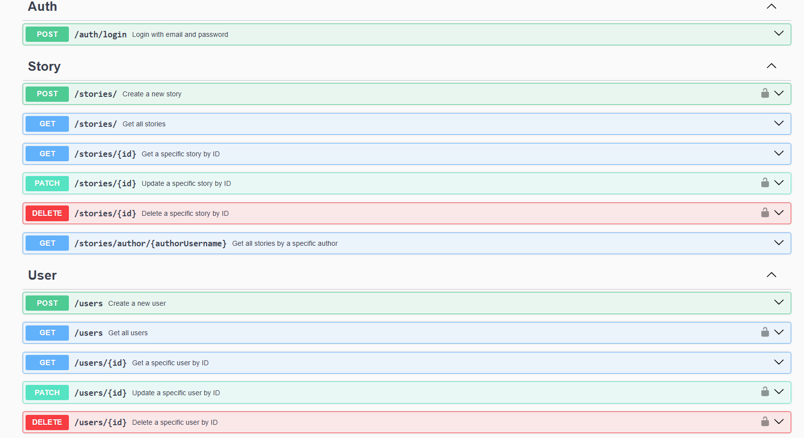

# DEV Jots Backend

<div align="center">


[](https://github.com/parvez-ahammed/dev-jots-backend/actions/workflows/build_test.yml)
[](https://github.com/prettier/prettier)
[](<(https://github.com/parvez-ahammed/dev-jots-backend?tab=AGPL-3.0-1-ov-file)%3E>)

</div>

This is Node.js project for the backend of the DEV Jots application. It is built utilizing the following technologies:


## Prerequisites

Make sure you have the following tools installed on your system:


## Getting Started

1.  Clone this repository to your local machine.

    ```bash
    git clone https://github.com/parvez-ahammed/dev-jots-backend.git
    cd dev-jots-backend
    ```

2.  Copy the `.env.example` file and update the necessary environment variables.

    ```bash
        cp .env.example .env
    ```

3.  Start the Docker containers for the project.

    - Create a Docker network if not created called `dev-jots-net`.

        ```bash
        docker network create dev-jots-net
        ```

        ```bash
        docker compose up -d
        ```

        This will start the application, including its dependencies, in detached mode.

For further information, please refer to the [documentation](https://github.com/parvez-ahammed/dev-jots-backend/blob/develop/DOCUMENTATION.md).
